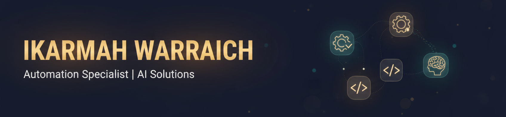

  

<h1 align="center">Hey there! I'm Ikarmah 👋</h1>

  <strong>Co-founder & Automation Specialist @ MA4 Ltd</strong> 
  <em>Former Pakistan Navy Officer | Supply Chain → AI Automation</em>

  

---

## 🚀 About Me

I spent **6 years as a Pakistan Navy Supply Chain Officer**, managing 45,000+ SKUs, leading teams, and making data-driven decisions under pressure. That experience taught me something crucial:

> *"80% of automation failures stem from poor data quality. Clean and structure your data FIRST, then automate."*

Now I build **AI-powered automation solutions** that help businesses eliminate repetitive tasks, maintain consistency, and scale operations — all grounded in real operational experience.

---

## 🛠️ Tech Stack

  
  
  
  
  
  

  
  
  
  
  
  

---

## 📂 Featured Projects

<table>
  <tr>
    <td align="center" width="33%">
      
        
      <strong>Chat with your company data</strong> 
      SOPs • Policies • Correspondence Rules  
      <code>n8n</code> <code>Gemini</code> <code>GPT-4o</code> <code>RAG</code>
    </td>
    <td align="center" width="33%">
      
        
      <strong>AI-powered candidate analysis</strong> 
      Scoring • Risk Assessment • PDF Reports  
      <code>n8n</code> <code>OpenRouter</code> <code>GPT-4o</code>
    </td>
    <td align="center" width="33%">
      
        
      <strong>AI-powered branded visuals</strong> 
      Double Exposure • Brand Consistency  
      <code>n8n</code> <code>Gemini</code> <code>Google Drive</code>
    </td>
  </tr>
</table>

---

## 📜 Certifications

| Certification | Issuer | Year |
|--------------|--------|------|
| 🎓 Google Data Analytics | Google | 2025 |
| 🤖 Make.com AI Agents & Automation (Advanced) | Make.com | 2025 |
| ⚓ Advanced Naval Supply Chain Management | Pakistan Navy | 2020 |

---

## 🤝 Let's Connect

Building something that needs automation? Let's talk.

  

  <em>"Stop doing repetitive tasks. Let AI handle it."</em>

---

  

